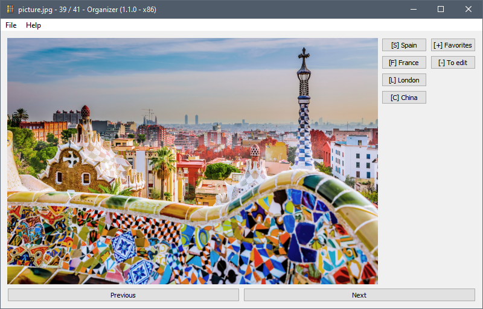

<p align="center"></p>

<h1 align="center">Organizer</h1>

[](https://github.com/Spark-NF/organizer/releases/latest)
[](https://github.com/Spark-NF/organizer/releases/latest)
[](https://github.com/Spark-NF/organizer/releases)
[](https://github.com/Spark-NF/organizer/issues)
[](https://github.com/Spark-NF/organizer/actions)
[](https://raw.githubusercontent.com/Spark-NF/organizer/develop/LICENSE)

## About
Organizer allows to load a bunch of media files, show/play them, and allowing the user to do custom actions on them on the press of a button.

For example, it can be used to sort a vacation's pictures and videos and put them in separate folders according to their location, the context, etc. The images/videos will be shown one by one, then the user can use shortcuts to move them quickly to separate directories.

### Download
You can download the latest release [here](https://github.com/Spark-NF/organizer/releases/latest), or find all previous releases [here](https://github.com/Spark-NF/organizer/releases).

For users interested, a nightly version is built automatically on every commit, and can be downloaded [here](https://github.com/Spark-NF/organizer/releases/nightly). Note that it might be less stable than official releases, so use at your own risk.

### Screenshots



### Languages
* English

### Authors
* Nicolas Faure ([Spark-NF](https://github.com/Spark-NF))

### License
The script is licensed under the [Apache License 2.0](http://www.apache.org/licenses/LICENSE-2.0).

## Building
Note: you need to have CMake, a C++ compiler, and the Qt libraries installed to build the project.

```
mkdir build
cd build
cmake ../src
make -j 8
```

You'll find the built binary in the `build/` directory, named `Organizer`.

## Profiles

### Profile file
A profile file is a JSON file that contains a single profile as the root object.

A profile is a JSON object with a few options:
* **name**: the name of the profile to show in the interface
* **rules**: an array or an array of arrays of rules (see below)

The first array represents the columns of actions, and the second each row of those columns. When using a single depth of arrays, there will be a single column. This is mainly useful for manual rules.

Example:
```json5
{
    "name": "My profile",
    "rules": [
        {
            // rule 1
        },
        {
            // rule 2
        }
    ]
}
```

With multiple columns:
```json5
{
    "name": "My profile",
    "rules": [
        [
            {
                // column 1, rule 1
            },
            {
                // column 1, rule 2
            }
        ],
        [
            {
                // column 2, rule 1
            },
            {
                // column 2, rule 2
            }
        ]
    ]
}
```

### Rules
A rule is a JSON object with a few options:
* **name**: the name of the action that will be displayed on the button
* **shortcut**: the assigned keyboard shortcut (ex: `H`, `3`, `Ctrl+X`, etc.)
* **final**: if set to true, triggering this action will also go to the next item (default: `false`)
* **conditions**: an array of conditions (see below), if any of them matches the actions will be run automatically (default: empty)
* **actions**: an array of actions (see below) to run when running this rule

Example:
```json5
{
    "name": "Hello",
    "shortcut": "H",
    "conditions": [{
        // ...
    }],
    "actions": [{
        // ...
    }]
}
```

### Actions
An action is a JSON object with a few common options:
* **type**: the type of the action (such as `rename` or `move`)
* **name**: the name of the action that will be displayed on the button
* **shortcut**: the assigned keyboard shortcut (ex: `H`, `3`, `Ctrl+X`, etc.)
* **final**: if set to true, triggering this action will also go to the next item (default: `false`)

#### Rename
Rename the file. The new name can be in another folder. If it doesn't exist, it will be created.

Additional options:
* **from**: a regular expression to match the original filename
* **to**: what to replace the regular expression match with (use `\1`, `\2`... for matched groups)
* **overwrite**: set to true to will overwrite any already existing file (default: `false`)

Example:
```json
{
    "type": "rename",
    "name": "!!!",
    "shortcut": "3",
    "from": "!*(.+)",
    "to": "!!!\\1"
}
```

#### Move
Move the file to a different directory. The destination can be relative or absolute.

Additional options:
* **dest**: the destination directory, either absolute or relative to the current browsed directory
* **create**: whether to create the destination directory if it doesn't exist (default: `true`)
* **overwrite**: set to true to will overwrite any already existing file (default: `false`)

Example:
```json
{
    "type": "move",
    "final": true,
    "name": "Hello",
    "shortcut": "H",
    "dest": "C:\\Users\\Nicolas\\Documents\\Test\\Hello"
}
```

#### Process
Run a custom command.

Additional options:
* **cmd**: the binary to call
* **args**: the list of arguments to pass to the binary, `{var}` in either will be replaced by the variables below

Variables:
* **path**: the file absolute path
* **dir**: the directory absolute path
* **filename**: the full file name (including the extension)
* **basename**: the file name without the extension (until the last dot)
* **ext**: the file extension (starting from the last dot)
* **/**: the native separator of your platform (`/` on Windows, `\` on UNIX)

Example:
```json
{
    "type": "process",
    "final": false,
    "name": "Resize image",
    "shortcut": "R",
    "cmd": "magick",
    "args": ["{path}", "-resize", "150x150", "{dir}/{basename}_150x150.{ext}"]
}
```

#### Multiple
Run multiple actions in order. It will immediately stop if one of the actions fail.

Additional options:
* **actions**: a list of actions (many options such as `name`, `shortcut`, or `final` are unnecessary here)

Example:
```json5
{
    "type": "multiple",
    "final": false,
    "name": "Resize and move",
    "shortcut": "R",
    "actions": [
        {
            "type": "process",
            // ...
        },
        {
            "type": "move",
            // ...
        }
    ]
}
```

### Conditions
An condition is a JSON object with a few common options:
* **type**: the type of the action (such as `filename` or `filesize`)

#### Filename
Matches a file using its filename.

Additional options:
* **filename**: the filename condition to use, including the extension. Can use multiple patterns with the ";" separator (disabled when using regular expressions)
* **regex**: set to true to use regular expressions for matching (default: `false`)

Example:
```json
{
  "type": "filename",
  "filename": "*.jpg; *.png",
  "regex": false
}
```

#### Filesize
Matches a file using its size on disk.

Additional options:
* **min**: the minimum size in bytes, inclusive (`-1` for no minimum, default: `-1`)
* **max**: the maximum size in bytes, exclusive (`-1` for no maximum, default: `-1`)

Example:
```json5
{
    "type": "filesize",
    "min": 5242880 // 5 MB
}
```