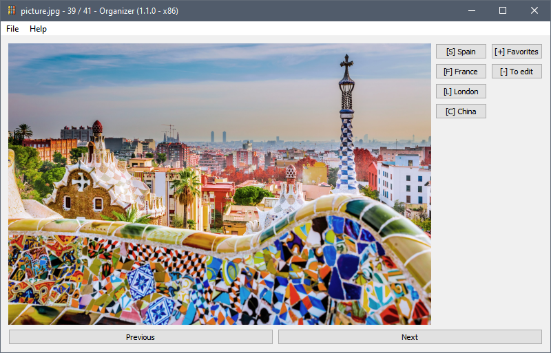

<p align="center"></p>

<h1 align="center">Organizer</h1>

[](https://github.com/Spark-NF/organizer/releases/latest)
[](https://github.com/Spark-NF/organizer/releases/latest)
[](https://github.com/Spark-NF/organizer/releases)
[](https://github.com/Spark-NF/organizer/issues)
[](https://github.com/Spark-NF/organizer/actions)
[](https://codecov.io/gh/Spark-NF/organizer)
[](https://raw.githubusercontent.com/Spark-NF/organizer/develop/LICENSE)

## About
Organizer applies rules to your files. Each rule has conditions (filename matches a pattern, extension is one of several types, EXIF tag equals a value...) and actions (move, rename, trash, run a script...). Rules run automatically on a batch of files, or on demand at the press of a key.

For example, it can be used to sort a vacation's pictures and videos and put them in separate folders according to their location, the context, etc. or to move old unused downloaded files to the trash automatically.

[Documentation](https://spark-nf.github.io/organizer/)

### Features

* **Three interfaces**:
  * **Drop window**: small always-on-top window for drag-and-drop sorting
  * **Manual sorting**: media viewer interface for working through media files one by one
  * **CLI**: for scripting and automation
* **Rich conditions**: filename, extension, MIME type, file size, date, EXIF metadata, ID3 tags, file content (text, PDF, DOCX)...
* **Templating**: use `{created|year}`, `{id3.Artist}`, `{extension|upper}`, etc. in action targets.
* **Composite actions**: a single rule can run multiple actions on a file in sequence.
* **Dry-run mode**: preview every operation before it touches a file.
* **Operation history**: every operation is logged.
* **Cross-platform**: Windows, macOS, and Linux.
* **Free and open source**: Apache 2.0 license.

### Download
You can download the latest release [here](https://github.com/Spark-NF/organizer/releases/latest), or find all previous releases [here](https://github.com/Spark-NF/organizer/releases).

For users interested, a nightly version is built automatically on every commit, and can be downloaded [here](https://github.com/Spark-NF/organizer/releases/nightly). Note that it might be less stable than official releases, so use at your own risk.

### Screenshots



### Languages
* English

### Authors
* Nicolas Faure ([Spark-NF](https://github.com/Spark-NF))

### License
The script is licensed under the [Apache License 2.0](http://www.apache.org/licenses/LICENSE-2.0).

## Building
Note: you need to have CMake, a C++ compiler, and the Qt libraries installed to build the project.

```
mkdir build
cd build
cmake ../src
make -j 8
```

You'll find the built binaries in the `build/` directory, named `Organizer`.
